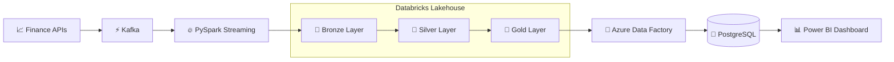
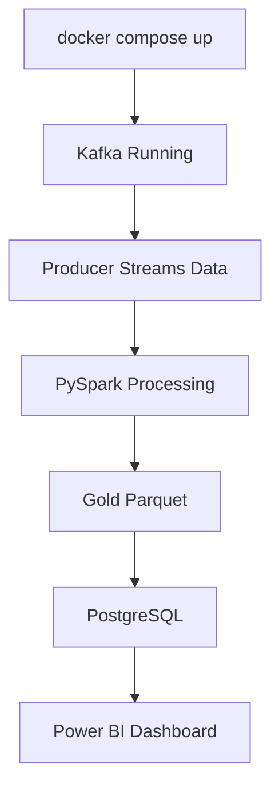
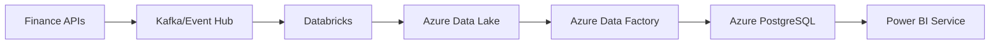

# 🚀 Real-Time Financial Intelligence Data Pipeline

<p align="center">


</p>

---

## 📌 Project Overview

An end-to-end data engineering pipeline that streams live stock quotes through Kafka, processes them with PySpark, lands them in a medallion-architecture lakehouse on Azure Data Lake Storage via Databricks, orchestrates the nightly batch with Azure Data Factory, serves the results from PostgreSQL, and visualizes everything in Power BI.

---

## 🏗️ High-Level Architecture



---

## 🔄 End-to-End Data Flow

```text
Finance APIs
      │
      ▼
   Kafka
      │
      ▼
PySpark Streaming
      │
      ▼
 Databricks Lakehouse
 ┌─────────────────┐
 │ Bronze Layer    │
 │ Silver Layer    │
 │ Gold Layer      │
 └─────────────────┘
      │
      ▼
Azure Data Factory
      │
      ▼
 PostgreSQL
      │
      ▼
   Power BI
```

---

## 🏆 Project Highlights

✅ Real-Time Streaming Architecture

✅ Medallion Lakehouse Architecture

✅ PySpark Structured Streaming

✅ Azure Data Factory Orchestration

✅ PostgreSQL Analytics Warehouse

✅ Power BI Executive Dashboards

✅ Dockerized Deployment

✅ CI/CD with GitHub Actions

---

## 🛠️ Technology Stack

| Layer         | Technologies            |
| ------------- | ----------------------- |
| Data Source   | Finance APIs            |
| Streaming     | Apache Kafka            |
| Processing    | PySpark                 |
| Lakehouse     | Databricks              |
| Storage       | Azure Data Lake Storage |
| Orchestration | Azure Data Factory      |
| Database      | PostgreSQL              |
| Visualization | Power BI                |
| DevOps        | Docker, GitHub Actions  |

---

## 📂 Repository Structure

```text
financial-intelligence-pipeline
│
├── common/
├── data_ingestion/
├── kafka/
├── spark_processing/
├── databricks/
├── azure/
├── postgres/
├── powerbi/
├── tests/
├── .github/workflows/
└── docker-compose.yml
```

---

## 🥉 Bronze Layer

Raw stock market events directly ingested from Kafka.

### Sample Fields

* symbol
* timestamp
* open
* high
* low
* close
* volume

---

## 🥈 Silver Layer

Validated and transformed market data.

### Operations

* Data Cleaning
* Type Casting
* Schema Validation
* Missing Value Handling

---

## 🥇 Gold Layer

Business-ready analytical datasets.

### Metrics Generated

* Average Price
* Total Volume
* Daily Return (% Change)
* Volatility
* RSI-14 Indicator

---

## 📊 Dashboard Preview

### Executive Summary Dashboard

```text
✔ Total Stocks Tracked
✔ Average Stock Price
✔ Total Trading Volume
✔ Daily Performance
```

### Stock Performance Dashboard

```text
✔ Price Trends
✔ Volume Trends
✔ Volatility Analysis
✔ Percentage Change Analysis
```

---

## 🚀 Local Deployment Flow



---

## ☁️ Azure Deployment Flow



---

## 🧪 Testing

```bash
pytest tests/ -v
```

### Coverage

* SMA Calculation
* Volatility
* RSI-14
* Percentage Change
* Kafka Schema Validation

---

## 🎯 Resume-Worthy Skills Demonstrated

* Data Engineering
* Real-Time Streaming
* ETL/ELT Pipelines
* Lakehouse Architecture
* Cloud Data Platforms
* Data Warehousing
* Dashboard Development
* DevOps & CI/CD

---

## 🔮 Future Enhancements

* Historical Market Backfill
* Airflow Integration
* FastAPI Analytics Layer
* Real-Time Alerts
* Machine Learning Forecasting
* Event Hub Integration
* AKS Deployment

---

## 👨‍💻 Author

### Jawagar K R

B.Tech – Computer Science and Business Systems

VIT-AP University

📧 [jawagarkrsoft@gmail.com](mailto:jawagarkrsoft@gmail.com)

🔗 GitHub: https://github.com/Jawa-vit

⭐ If you found this project useful, consider giving it a star!
